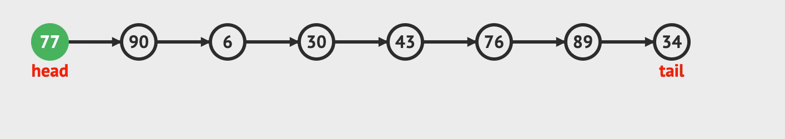
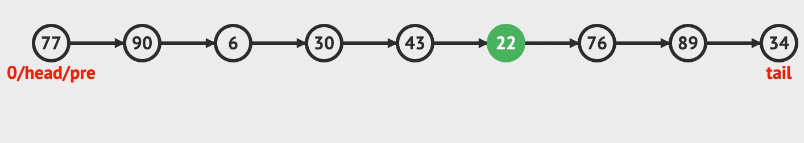

链表是一种很常见的，线性的数据结构。由一个个节点构成。每一个节点都是一个对象，
包含当前的值与指向下一个节点的指针。数组用索引将不同的元素连接起来，链表用指针将前后的元素连接起来。

```javascript

function Node(val, next = null) {
  this.val = val;
  this.next = next;
}

```

> 链表可以划分为单链表，循环单链表，双链表，循环双链表。下面使用
> 单链表作为实例来讲解。
> 以下动画全是来源于 [visualgo](https://visualgo.net/zh/list)

### 链表数据结构的特殊性

链表是一种线性的数据结构，由多个节点组成，每一个节点指向下一个节点。具有天然的递归性质。此外，一个链表也可以看作是
一个完全不平衡的二叉树。可以利用其递归性来解决很多问题。

如: 合并两个有序链表，利用其递归性质，可以这样写:

```javascript

var mergeTwoLists = function(l1, l2) {
  if (l1 === null) return l2;
  if (l2 === null) return l1;
  if (l1.val < l2.val) {
    l1.next = mergeTwoLists(l1.next, l2);
    return l1;
  } else {
    l2.next = mergeTwoLists(l1, l2.next);
    return l2;
  }
}

```

链表与数组的操作对比，都具备可遍历，查找，修改，删除操作。由于节点与节点之间是通过指针来进行连接。插入，修改操作在已知节点的情况下，时间复杂度可以达到O(1)。而数组在在同等的情况下，需要考虑后续元素的位置移动。而在查找的情况下，数组可以通过索引快速的找到目标元素。而链表只能通过遍历来找到目标元素。两种数据结构在不同的使用场景下，操作效率也会大不相同。

下面，通过一些示例代码与动画进行链表操作的演示。

#### 查找

在链表中查找元素，需要不断的遍历链表，将每一个节点的值与目标匹配。如果匹配，那么返回该节点。否则，指针指向下一个节点。

```javascript

function find(node, target) {
  // 设置临时变量，不改变原数据
  let origin = node;
  while(origin) {
    if (origin.val === target) return origin;
    origin = origin.next;
  }
  return null;
}
```
在链表中查询值为 76 的节点


#### 插入

在链表中插入元素，如果在已知节点的情况下，直接改变相关节点的指针指向即可。如果在未知节点的情况下。需要先查找相关节点。再改变
相关节点的指针指向。

该过程可以分为三个步骤

1. 构建需要插入的节点，称作为新节点
2. 新节点的 next 指向目标节点的 next
3. 目标节点的 next 指向新节点

```javascript

const current = find(target);
// 1. create new node
const newNode = new Node();
// 2. 新节点的next指向目标节点的next
newNode.next = current.next;
// 3. 目标节点的next指向新节点
current.next = newNode;
```

在值为 43 的节点后插入值为 22 的节点



#### 删除

在链表中删除一个节点，如果在已知节点的情况下，直接操作相关节点的指针即可。如果在未知节点的情况下，可以先查找相关节点，再改变
相关节点的指针指向。

**注: 这里的已知节点是待删除节点的前一个节点**

该过程可以分为两个步骤

1. 找到待删除节点的前一个节点(称为已知节点)
2. 将待删除的节点的 next 节点赋值给临时节点
3. 改变已知节点的next指向临时节点并将待删除的节点的 next 指向 null

```javascript
// 已知节点, 可能为 null
const preNode;
// 待删除节点, 假设存在
const deletes;

const temp = deletes.next;

if (preNode) preNode.next = temp;
// 否则待删除节点是头节点，重新定义链表的头节点
else head = deletes.next;

deletes.next = null;
```

删除值为43的节点



### 链表的常见技巧的应用

链表作为一种线性，递归型，具有指针指向的数据结构。操作链表的同时即是在操作指针。在基本算法的技巧中，双指针，三指针这种技巧
时常被使用到，而链表天然的结构特性，注定着双指针可以解决链表中的很多特性。

下面，列举一些常见的问题，然后利用双指针来解决这些问题。

1. 找链表的中间节点。
2. 判断链表中是否存在环
3. 如果链表有环，如何确定环的入口

> 以下题目与图片均来自于 [leetcode](https://leetcode-cn.com/)

#### 找链表的中间节点

约束: 给定一个带有头结点 head 的非空单链表，返回链表的中间结点。如果有两个中间结点，则返回第二个中间结点。
该链表内无环状结构

```javascript

输入: 1 -> 2 -> 3 -> 4 -> 5

输出: 3

输入: 1 -> 2 -> 3 -> 4 -> 5 -> 6

输出: 4

```

只有在遍历链表后，才可以知道链表的数量。那么，在只遍历一遍的情况下，如何才能确定链表的中间节点呢?

假设，我们可以设置两个指针来追溯链表遍历的情况，一个指针正常遍历，另一个指针的遍历速度是该指针的两倍。两个指针同时出发。因为链表是有限的。那么，快指针走到终点的时刻，慢的指针恰好落在中间节点。

我们需要确定，如果有两个中间节点的情况下，慢的指针恰好落在第二个中间节点上。以下是代码演示。

```javascript

var middleNode = function(head) {
    if (head.next === null) return head;
    let slow = fast = head;
    while(fast && fast.next) {
      slow = slow.next;
      fast = fast.next.next;
    }
    return slow;
};

```

#### 判断链表是否有环

给定一个链表，判断链表中是否有环。为了表示给定链表中的环，我们使用整数 pos 来表示链表尾连接到链表中的位置（索引从 0 开始）。 如果 pos 是 -1，则在该链表中没有环

还是利用快慢指针，如果链表有环状结构，那么必定是无限循环的。可以在遍历的阶段给节点做标记来完成环的判断，即如果再一次遇到做的标记，那么，必定是存在环的。同时，我们也可以利用快慢指针来完成环的探测。

假设一个操场，两位同学在跑步，如果一个同学始终跑的比另一个同学快。那么，跑的快的迟早会追上跑的慢的。但是，这有一个前提。操场是环状的。也就是闭合的。如果只是一条有尽头的路，那么两位同学只能在尽头相遇了。

这里有两个条件，一是快的始终比慢的跑的快。而是不能在尽头相遇。这样，可以探测出环。

```javascript

var hasCycle = function(head) {
  // try catch 在这里表示，如果到了尽头继续往前走
  // 就会触发报错
  try {
    let slow = head;
    let fast = head.next.next;
    while(slow !== fast) {
      slow=slow.next;
      fast = fast.next.next;
    }
    return true;
  } catch(err) {
    return false;
  }
};

```

#### 如果链表有环，如何确定环的入口

继续上一个问题来探索，如果链表有环，且快慢指针相遇，那么相遇的地点是环的入口吗?

答案肯定不是，相遇的地点可能是环的中心，也可能是1/4处，在入口处相遇的可能性不大。那么，如何确定环的入口呢?

这里换一种思路来解决问题，如果每走向下一个节点，利用节点是对象的这一特性做个标记属性，再次遇到该标记属性。不就是环的入口吗?
这样，整体的思路就变得简单起来。

```javascript

var detectCycle = function(head) {
    while(head) {
      if (head.through === 1) return head;
      head.through = 1;
      head = head.next;
      if (head === null) return null;
    }
    return null;
};

```
### 总结

利用链表的数据结构特性，我们可以构建出 LRU 缓存策略，利用指针的特性，可以快速判断回文链表，旋转链表。如果在项目中需要对数据大量插入，删除操作的场景，可以优先考虑链表来实现。缓存作为一种有用的结构，其内部就需要不断的进行插入与删除操作。利用好这一特性，可以在很大程度上提高程序运行的效率。在满足程序可用的基础上，我们应该思考如何构建高效率的应用程序，很显然，链表在一些场景下，可以派上用场。


